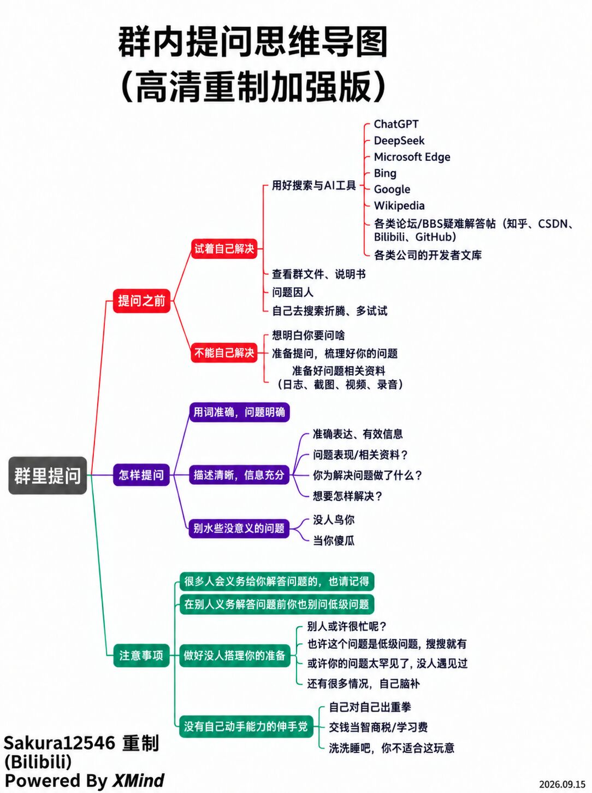

# Lesson 1：基础工具与开发环境

## 1. 提问与解决问题

[适合rm宝宝体质的提问的艺术](https://bbs.robomaster.com/article/810096?source=4)

遇到问题时，建议按以下顺序处理：

1. 先尝试自己定位和解决问题，培养独立思考能力。
2. 查阅搜索引擎、官方文档，并向 AI 提问。
3. 整理好背景、报错信息和已尝试的方法后，再向学长学姐请教。

## 2. Git 与 GitHub

- [Git 和 GitHub 的傻瓜式教程](https://www.douyin.com/video/7641177391708015907)
- [廖雪峰 Git 教程](https://liaoxuefeng.com/books/git/what-is-git/svn-vs-git/index.html)

## 3. Ubuntu 与 C++ 环境

- 完成 Ubuntu 系统配置，参考：[Win11 安装 Ubuntu 双系统](https://www.bilibili.com/video/BV1Cc41127B9/?spm_id_from=333.337.search-card.all.click&vd_source=8046907425269c14afbf6084b6bdf0a2)。
- 完成 Ubuntu 上的 C++ 开发环境配置，参考[飞书配置文档](https://fa4g5no1b1f.feishu.cn/wiki/VkvUwzmv9iPj8gkpTJxc4cgJnNf)和[崇实战队教程](https://www.wust-rm.top/posts/teach02/)。

## 4. C++ 基础

选择一个自己能持续看下去的 C++ 教程即可，并配合练习完成学习。

## Task 1

- [ ] 完成双系统安装。
- [ ] 配置 C++ 编译器和开发环境。
- [ ] 安装 Eigen3、Ceres Solver 和 Git。
- [ ] 成功访问 GitHub。
