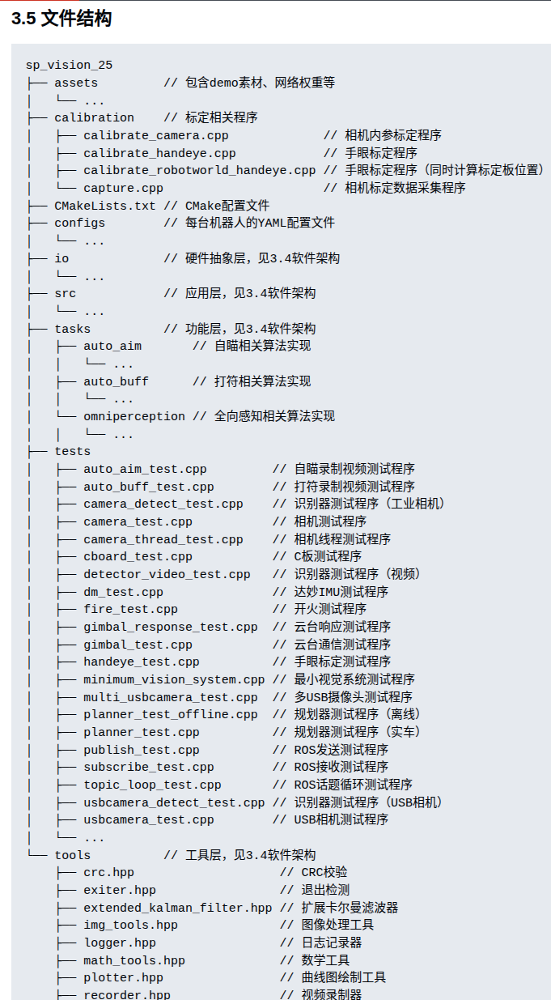

# Lesson 2：C++ 进阶与工程实践

从能够用 C++ 编写代码，进阶到能够参与工程项目开发，重点包括多文件编程、CMake 和面向对象编程（OOP）。

## 1. CMake

参考 [Super Power 的 CMake 教程](https://www.bilibili.com/video/BV1N3tTeoEqx/?spm_id_from=333.1387.homepage.video_card.click&vd_source=8046907425269c14afbf6084b6bdf0a2)。

## 2. 代码规范

阅读并实践[交龙的代码规范指南](https://sjtu-robomaster-team.github.io/cpp-style-guide/)。

## 3. 面向对象编程

学习封装、继承、友元等概念。参考 [Super Power 的 Hello OOP 教程](https://www.bilibili.com/video/BV17vn9zDELW?spm_id_from=333.788.videopod.sections&vd_source=8046907425269c14afbf6084b6bdf0a2)。

## 4. 项目结构

理解项目目录和模块划分，明确每个文件夹及文件的职责。可以参考 `sp_vision25` 的项目目录：

## Task 2

